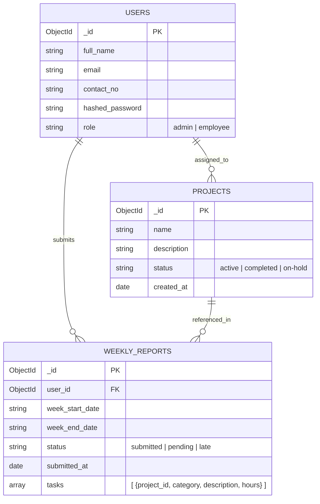

# TeamPulse: Weekly Report Generator & Team Dashboard

## 📌 Project Overview
TeamPulse is a comprehensive, full-stack Weekly Report Generator and Team Dashboard designed to streamline team communication and performance tracking. It provides a dedicated platform for employees to submit their weekly progress reports and for administrators/managers to monitor compliance, track project statuses, and gain actionable insights into team productivity.

## 🚀 Technologies Used
This project is built using a modern, high-performance tech stack:

**Frontend:**
- **React.js** (via Vite)
- **Tailwind CSS** (for utility-first styling)
- **CSS Custom Properties** (for animations and glassmorphism UI)
- **React Router DOM** (for client-side routing)
- **Chart.js** (for dashboard data visualization)

**Backend:**
- **FastAPI** (High-performance Python web framework)
- **MongoDB** (NoSQL Database)
- **Motor** (Asynchronous MongoDB driver for Python)
- **Pydantic** (Data validation and serialization)
- **JWT (JSON Web Tokens)** (For secure authentication)

---

## 📂 Project Structure

```text
Weekly-Report-Generator-Team-Dashboard/
│
├── backend/                  # FastAPI Backend Application
│   ├── app/
│   │   ├── config/           # Database and environment configurations
│   │   ├── models/           # Pydantic data models & schemas
│   │   ├── routes/           # API endpoints (auth, reports, admin, etc.)
│   │   ├── services/         # Core business logic and database queries
│   │   ├── utils/            # Helper functions (hashing, JWT auth)
│   │   └── main.py           # FastAPI application entry point
│   ├── .env                  # Backend environment variables
│   └── requirements.txt      # Python dependencies
│
├── frontend/                 # React Frontend Application
│   ├── src/
│   │   ├── components/       # Reusable UI components (Layouts, Modals)
│   │   ├── pages/            # Main application views (Dashboards, Auth)
│   │   ├── App.jsx           # Main React component & Router
│   │   └── main.jsx          # React DOM entry point
│   ├── index.css             # Global styles, variables, and Tailwind imports
│   ├── vite.config.js        # Vite bundler configuration
│   └── package.json          # Node.js dependencies and scripts
│
└── README.md                 # Project documentation
```

---

## 🗄️ Entity-Relationship (ER) Diagram

Although MongoDB is a NoSQL document database, the conceptual relationships between our collections can be visualized as follows:



---

## ⚙️ Setup & Installation Instructions

Follow these steps to run the project locally on your machine.

### Prerequisites
- **Node.js** (v16+ recommended)
- **Python** (3.9+ recommended)
- **MongoDB** (Running locally or a MongoDB Atlas connection string)

### 1. Backend Setup
1. Open a terminal and navigate to the backend directory:
   ```bash
   cd backend
   ```
2. Create a virtual environment (optional but recommended):
   ```bash
   python -m venv venv
   # Windows:
   venv\Scripts\activate
   # Mac/Linux:
   source venv/bin/activate
   ```
3. Install the required Python dependencies:
   ```bash
   pip install -r requirements.txt
   ```
4. Create a `.env` file in the `backend` directory with your database URI and JWT settings:
   ```env
   MONGODB_URL=mongodb://localhost:27017
   DATABASE_NAME=team_dashboard
   SECRET_KEY=your_super_secret_jwt_key
   ALGORITHM=HS256
   ACCESS_TOKEN_EXPIRE_MINUTES=1440
   ```
5. Start the FastAPI server:
   ```bash
   uvicorn app.main:app --reload
   ```
   *The backend API will be available at `http://127.0.0.1:8000`*

### 2. Frontend Setup
1. Open a new terminal window and navigate to the frontend directory:
   ```bash
   cd frontend
   ```
2. Install the required Node.js packages:
   ```bash
   npm install
   ```
3. Create a `.env` file in the `frontend` directory to map the backend API URL:
   ```env
   VITE_API_BASE=http://127.0.0.1:8000
   ```
4. Start the React development server:
   ```bash
   npm run dev
   ```
   *The frontend application will be available at `http://localhost:5173` (or the port specified by Vite).*

## 🎉 Usage
- Access the platform via the frontend URL.
- **Employees** can register a new account, log in, and begin submitting their weekly reports.
- **Administrators** can log into the Admin Dashboard to view platform-wide compliance, manage projects, and analyze team productivity charts.

## 🔗 Live URLs (Local Development)

*   **Employee :**``https://weekly-report-generator-team-dashbo-seven.vercel.app/login/* ``
*   **Admin  :**``https://weekly-report-generator-team-dashbo-seven.vercel.app/admin-login* ``
*   **Backend API Base URL :**``https://weekly-report-generator-team-dashboard-production.up.railway.app/*``

---

## 🔑 Demo Credentials

You can use the following credentials to test the system:

**Standard User:**
*   **Email:** `user@gmail.com`
*   **Password:** `User@1123`
*(Note: You can also register a new user from the Signup page)*

**Administrator:**
*   **Email:** `admin@gmail.com`
*   **Password:** `Admin@123`
*(Note: Must log in through the `/admin/login` portal)*
